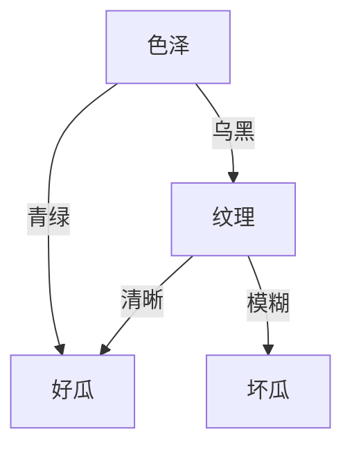

# 决策树

## 1.算法原理

决策树（Decision tree）是基于已知各种情况（特征取值）的基础上，通过构建树型决策结构来进行分析的一种方式，是常用的有监督的分类算法。

图：1

如图：1 所示，决策树即将数据特征通过计算 ***【信息增益】***，然后进行排序，不断选择可以将数据有效划分的最优解。

所以最终的任务就转化为特征的选取以及集成学习方向上。特征选取的算法主要有ID3.5、CART以及histogram-based等，集成学习主要有随机森林、GBDT等。

## 2. 过拟合与剪枝

如果分支太多，则会过拟合，所以需要提前剪枝，剪枝主要分为 ***【预剪枝】*** 与 ***【后剪枝】*** 。

### 2.1 预剪枝

预剪枝 过程如下：将其标记为叶结点，类别标记为训练样例中最多的类别。若划分后的验证集精度下降，则拒绝划分。

### 2.2 后剪枝

我们在生成的完整决策树上进行「后剪枝」：用验证集的数据对该决策树进行评估，剪枝后的精度提升了，因此该决策树需要在结点处进行剪枝。

***【预剪枝与后剪枝的特点】***

***【时间开销】***

预剪枝：训练时间开销降低，测试时间开销降低。
后剪枝：训练时间开销增加，测试时间开销降低。

***【过/欠拟合风险】***

预剪枝：过拟合风险降低，欠拟合风险增加。
后剪枝：过拟合风险降低，欠拟合风险基本不变。

***【泛化性能：后剪枝通常优于预剪枝。】***

## 3. 连续值处理

因为连续属性的可取值数目不再有限，因此需要连续属性离散化处理，常用的离散化策略是二分法，这个技术也是 C4.5 中采用的策略。

***【注意：与离散属性不同，若当前结点划分属性为连续属性，该属性还可以作为其后代结点的划分属性。】***

## 3. 缺失值处理

决策树对缺失值不敏感，一般会对之后的几个类别继续做信息增益计算，选择信息增益最大的继续判别。（具体取决于所调用的库），主要思想为样本赋权，权重划分。
[决策树实现](https://github.com/13540880715/machine_learning/tree/main/decision_trees)